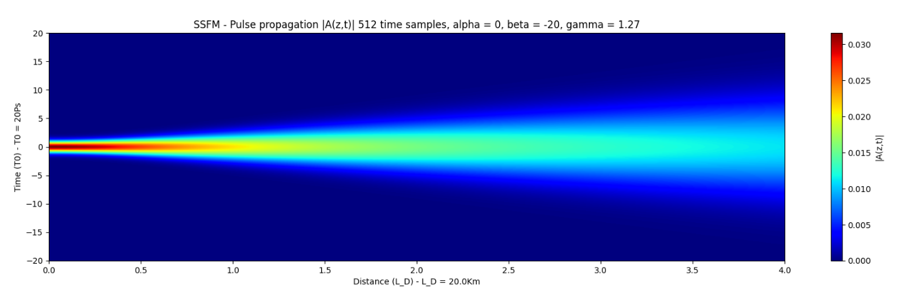
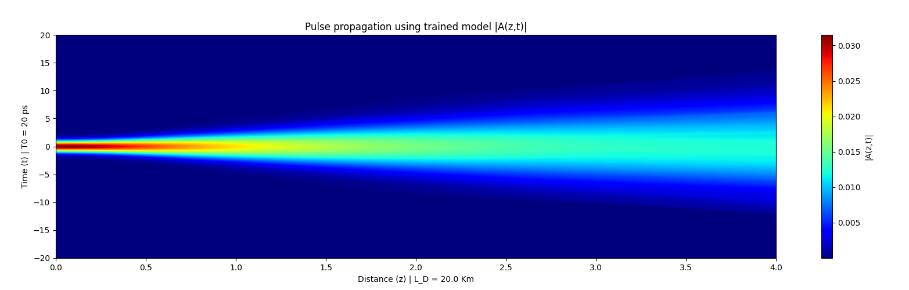
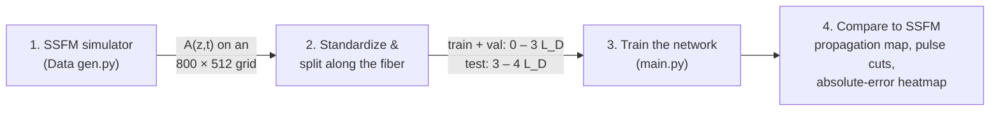
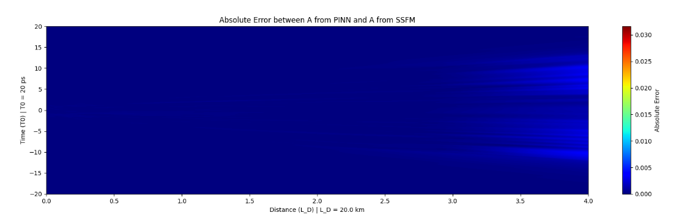
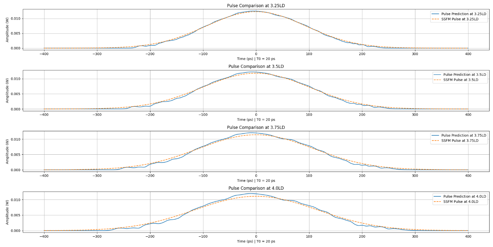
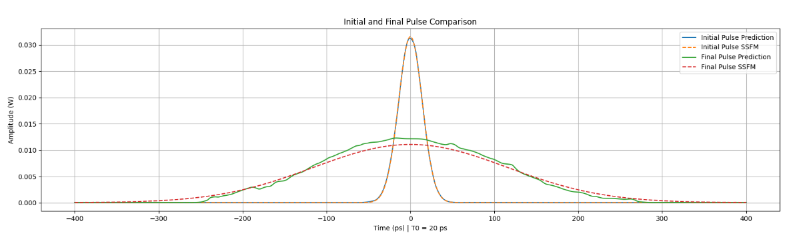
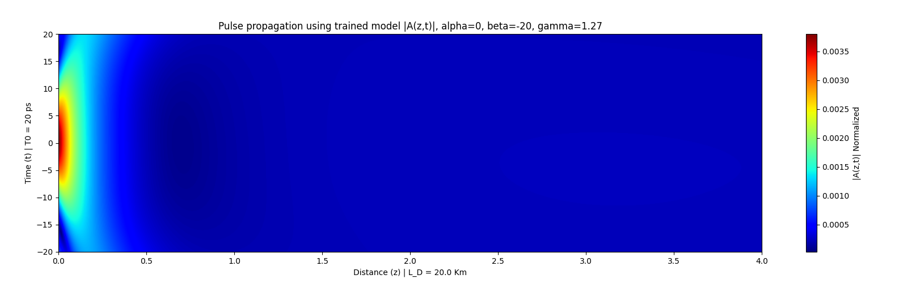

# Neural Network for Optical Pulse Propagation in Fiber

**Predicting how a light pulse evolves along an optical fiber with a neural network, as a faster alternative to the step-by-step Split-Step Fourier solver.**

B.Sc. final project (P-2024-004), Electrical & Computer Engineering, Ben-Gurion University, 2024
**Dotan Levy & Amit Toker** · Supervisor: Prof. Stanislav Derevyanko

| Ground truth (SSFM numerical solver) |
|:---:|
|  |
| **Neural network prediction**, where everything right of 3 L_D was never seen in training |
|  |

---

## TL;DR

- **Problem:** Simulating a signal traveling through optical fiber means solving the *Nonlinear Schrödinger Equation* (NLSE). The standard numerical method, the Split-Step Fourier Method (SSFM), marches through the fiber in hundreds of small steps with FFTs at each one, which gets expensive at high resolution and long distances.
- **Idea:** Train a neural network that takes a position along the fiber `z` and a time `t`, and directly outputs the pulse's complex field `A(z, t)` in one forward pass.
- **What we built:** An end-to-end pipeline in **Python / PyTorch**: an SSFM simulator to generate ground-truth data, a fully connected network, a physics-informed (NLSE residual) loss using automatic differentiation, a training loop with early stopping, and evaluation and visualization tools.
- **Result:** The network was trained on the first 3 dispersion lengths of the fiber and **accurately predicted the pulse over the last 25% it had never seen**. The pure physics-informed version didn't converge in time (details [below](#from-pinn-to-dnn-what-we-learned)).

---

## Background (the short version)

When a short light pulse travels through an optical fiber, three effects change it:

| Effect | What it does | Parameter |
|---|---|---|
| **Chromatic dispersion** | Different frequencies travel at different speeds, so the pulse **spreads out** in time | β₂ |
| **Kerr nonlinearity (SPM)** | The refractive index depends on intensity, so the pulse **distorts its own phase** | γ |
| **Attenuation** | Power loss along the fiber | α |

These are described by the **Nonlinear Schrödinger Equation** for the pulse envelope `A(z, t)`:

$$
\frac{\partial A}{\partial z} = -\frac{i\beta_2}{2}\frac{\partial^2 A}{\partial t^2} - \frac{\alpha}{2}A + i\gamma |A|^2 A
$$

There's no closed-form solution in general, so it's usually solved numerically with **SSFM**: split the fiber into small steps, and in each step apply dispersion in the frequency domain (FFT) and nonlinearity in the time domain. The cost is **O(M · N log N)** for M distance steps and N time samples, and it has to be re-run every time.

A trained network instead evaluates `A(z, t)` at any point with a handful of matrix multiplications.

---

## How it works



### 1. Ground-truth data: SSFM simulation (`Data gen.py`)
- A Gaussian pulse (T₀ = 20 ps, P₀ = 1 mW) is propagated through **80 km** of fiber, which is 4 dispersion lengths (L_D = T₀²/|β₂| = 20 km).
- Fiber parameters: β₂ = −20 ps²/km, γ = 1.27 W⁻¹km⁻¹, α = 0.
- Output: the complex field on an **800 (distance) × 512 (time)** grid, i.e. ~410k samples of `(z, t) → (Re A, Im A)`.
- The data is **split by distance, not randomly**. The model trains on the beginning of the fiber and is tested on the end, so the test measures true *extrapolation* rather than interpolation between neighboring points.

### 2. The model (`functions.py`)
- Fully connected network: **2 inputs `(z, t)` → 4 hidden layers (tanh) → 2 outputs `(Re A, Im A)`**.
- Loss functions implemented:
  - **Supervised MSE** against SSFM data (used for the final model)
  - **NLSE residual**: the network's own derivatives ∂A/∂z and ∂²A/∂t² (via PyTorch `autograd`) are plugged into the equation above
  - **Initial-condition** and **boundary-condition** MSE (for the PINN formulation)

### 3. Training (`main.py`)
- Adam optimizer, batch size 128.
- Best model is checkpointed on validation loss, with **early stopping**.
- Train / validation / test loss is tracked every epoch.

---

## Results

The network's prediction closely matches the SSFM ground truth over the whole fiber, including the unseen test region (3–4 L_D).

**Absolute error |A_NN − A_SSFM|** (same color scale as the pulse itself). The error stays small and only starts to appear in the unseen region near the end of the fiber:



**Pulse shape at 3.25, 3.5, 3.75 and 4 L_D**, all inside the unseen test region (solid = network, dashed = SSFM):



**Input vs output pulse.** After 80 km, dispersion has spread the narrow input pulse out many times over, and the network reproduces the final shape:



**Key findings**
- Predictions in the unseen region match SSFM closely, with minor discrepancies mainly near the pulse edges.
- We also tested training splits from **22.5% up to 85%** of the fiber. Even with only 22.5% of the data used for training, the model stayed relatively accurate. As expected, accuracy improves with more training data and drops significantly when extrapolating beyond ~3× the trained distance.

---

## From PINN to DNN: what we learned

The original goal was a pure **Physics-Informed Neural Network (PINN)**: train mainly on the NLSE residual plus the initial and boundary conditions, with no need for SSFM data.

In practice, the PINN **did not converge** to the right solution. Its predictions showed far too much dispersion and attenuation, and the pulse faded out early along the fiber:



We spent about two months trying different approaches to fix the combined loss. Given the project deadline, and with our supervisor's approval (documented in the project report), the final model is trained with the **supervised loss against SSFM data**. The architecture is the same; only the loss function differs. The physics-residual code remains in the repo (`nlse_residual_pytorch` in `functions.py`) as the basis for future work.

Getting PINNs to train on stiff, oscillatory, complex-valued equations like the NLSE is a known hard problem. Directions we'd try next:
- Rescale the NLSE residual to match the standardized input/output variables
- Adaptive weighting between the residual, initial-condition and boundary-condition loss terms
- Curriculum training: start with short propagation distances and extend gradually

---

## Running the project

**Requirements:** Python 3.9+

```bash
pip install -r requirements.txt
```

**1. Generate the SSFM data** (takes a few seconds):
```bash
python "Data gen.py"
```
This creates `processed_training_data.npz`, `parameters.pkl` and the SSFM reference plots.

**2. Train and evaluate:**
```bash
python main.py
```
You'll be asked for the number of epochs and whether to resume from a saved checkpoint (`best_model.pth`). When training finishes, all plots are saved under `plots/`.

### Repository structure

```
├── Data gen.py      # SSFM simulator + dataset creation (standardization, train/val/test split)
├── functions.py     # Network, loss functions (supervised, NLSE residual, IC/BC), plotting
├── main.py          # Training loop, early stopping, checkpointing, evaluation
├── requirements.txt
└── docs/images/     # Figures used in this README
```

---

## Tech stack

**Python · PyTorch · NumPy · SciPy (FFT) · scikit-learn · Matplotlib**

## References

1. G. P. Agrawal, *Nonlinear Fiber Optics*, 5th ed., Academic Press, 2013.
2. X. Jiang, D. Wang et al., "Physics-Informed Neural Network for Nonlinear Dynamics in Fiber Optics," *Laser & Photonics Reviews*, 2022. [doi:10.1002/lpor.202100483](https://doi.org/10.1002/lpor.202100483)
